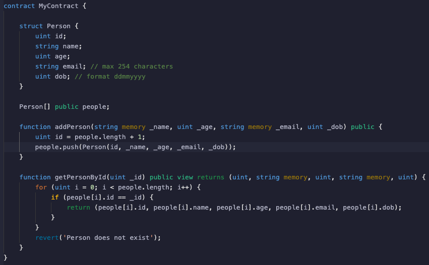

# Exercise 3

### A fellow engineer asked you to review this piece of code as it appears to be very GAS inefficient, can you review and suggest what areas of the contract need to be optimised and how you do this.

