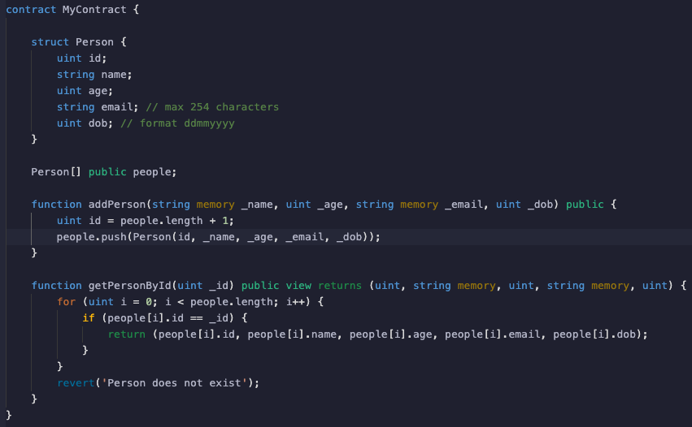

# Exercise 2

### An anonymous white hat hacker gets in contact with us and says he has found an issue with the following piece of code. Highlight the issue and detail how you could improve and fix the problem.

